# Student-Management-System

* Student-Management-System, hibernate (sqlServer) + swing  
* Sinh viên: Nguyễn Bảo Long  
* MSSV: 18120201  
* Email: 18120201@student.hcmus.edu.vn  

## Clone về máy và chạy  

* Đồ án sử dụng SQLServer  
* File cấu hình `SQLSetting.txt` chứa username, password và tên db. Có thể sửa đổi các thông tin này cho phù hợp  
* Các tuỳ chọn sửa đổi sâu hơn về DB nằm trong file `HibernateUtil.java` (nằm trong đường dẫn ./src/main/java/com/hibernate/util/HibernateUtil.java)  
* Build: `mvn compile`  
* Package: `mvn package`  
* Run: `java -jar QLSV.jar`. File jar ở trong 

## Các chức năng trong bài

1. Import danh sách lớp  
2. Thêm 1 sinh viên vào lớp  
3. Import TKB cho lớp  
    3.1. Mặc định mọi sinh viên đều phải học các môn học có trong tkb của lớp mình  
    3.2. Sinh viên xem được tkb của mình  
4. Đăng ký/Huỷ đăng ký môn học  
5. Xem danh sách lớp  
6. Xem TKB  
    6.1. Xem tkb của cả 1 lớp  
    6.2. Xem tkb của 1 sinh viên  
7. Import bảng điểm theo lớp học + môn học  
8. Xem bảng điểm
    8.1. Xem bảng điểm theo lớp học + môn học  
    8.2. Cho biết tỷ lệ đậu rớt và danh sách đậu rớt kèm theo  
9. Sửa điểm 1 sinh viên  

## Màn hình chính  

## Yêu cầu 1: Thêm danh sách lớp  

* Chọn file cần import  
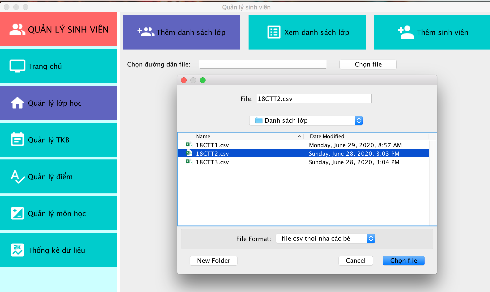  
  
* Kết quả sau khi import  
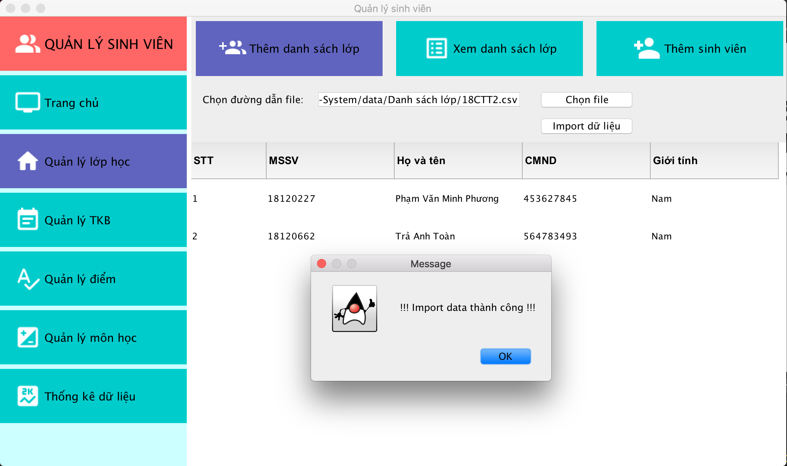  

## Yêu cầu 2: Thêm 1 sinh viên vào lớp  

* Nhập thông tin sinh viên mới (nếu nhập trùng sẽ báo lỗi)  
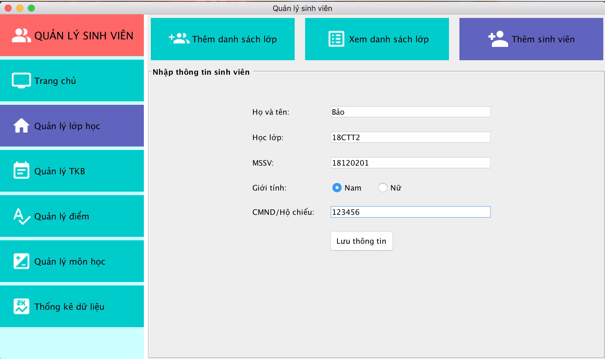  
  
* Kết quả sau khi import  
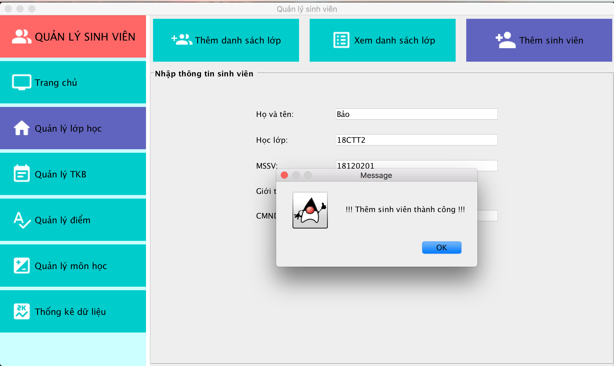  

## Yêu cầu 3: Import TKB  

* Chọn file TKB cần import  
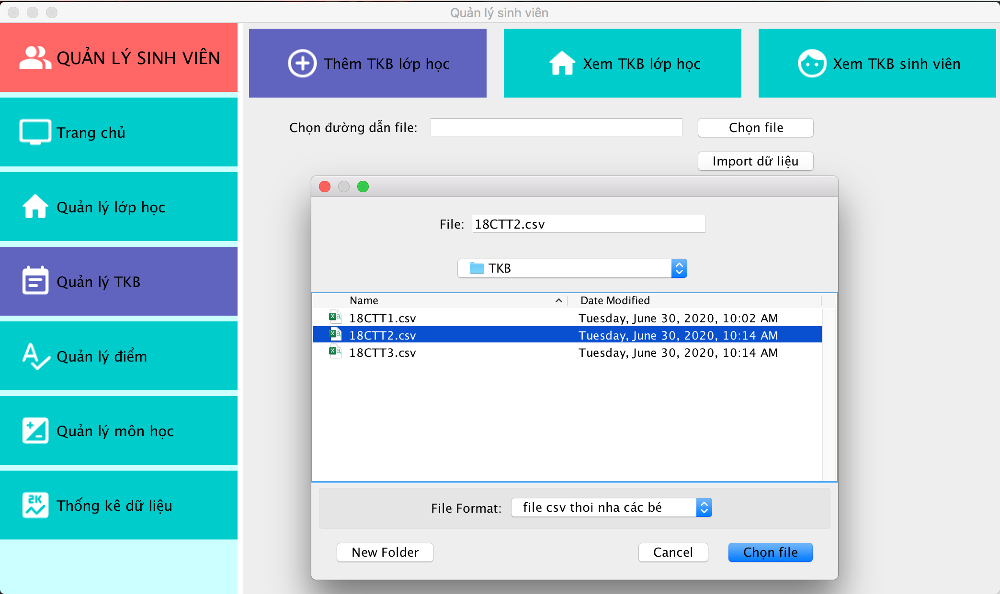  
  
* Kết quả sau khi import  
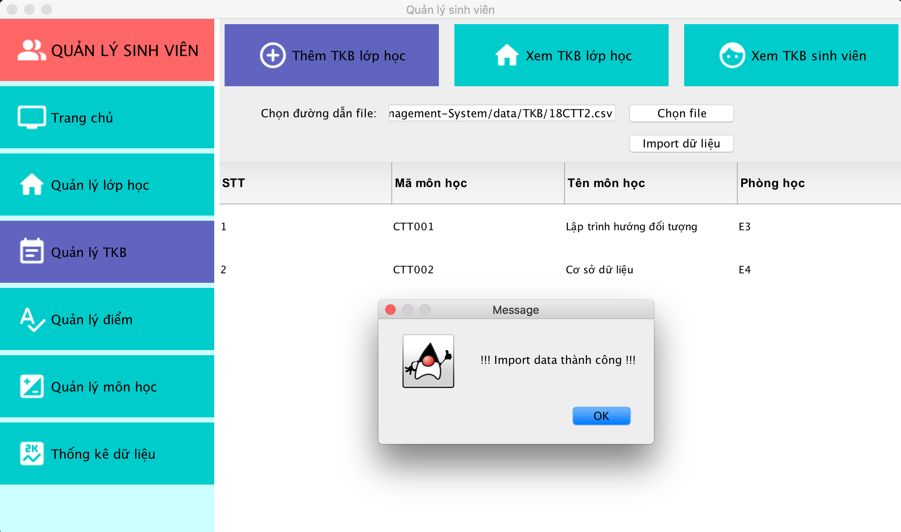  

## Yêu cầu 4: Đăng ký/Huỷ đăng ký môn học  

### Huỷ đăng ký môn học  

* Sinh viên `Bảo - MSSV: 18120201` đang học `OOP` và `DB` tại lớp `18CTT2` sẽ bị huỷ môn `OOP`  
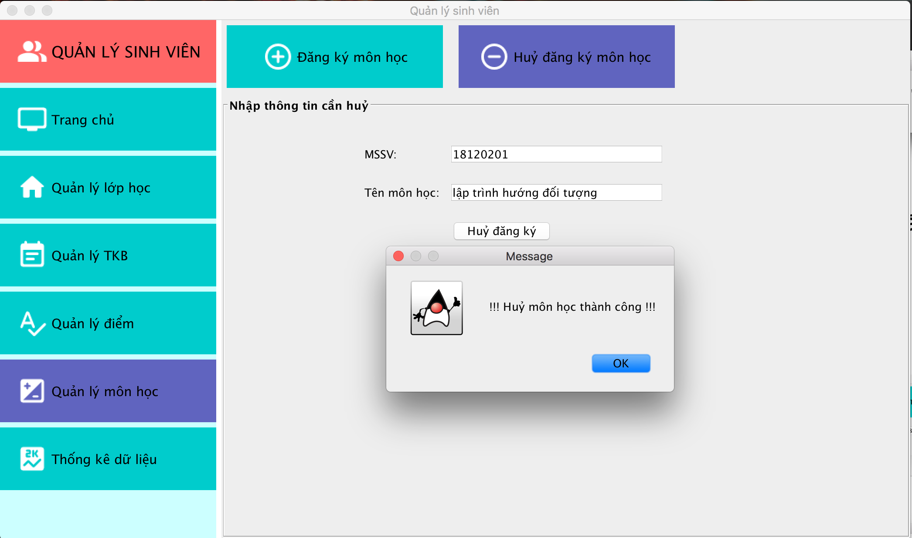  

### Đăng ký môn học  

* Nhập thông tin đăng ký môn học `OOP` cho `Bảo - MSSV: 18120201` và chọn `Đăng ký`  
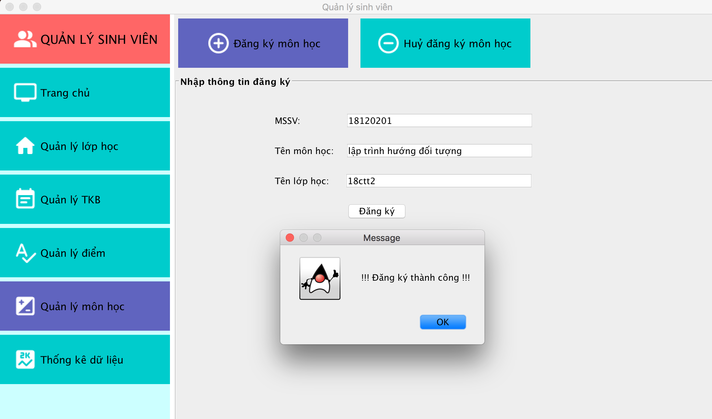  

## Yêu cầu 5: Xem danh sách lớp  

* Nhập tên lớp `18CTT2` và chọn `Xuất danh sách`
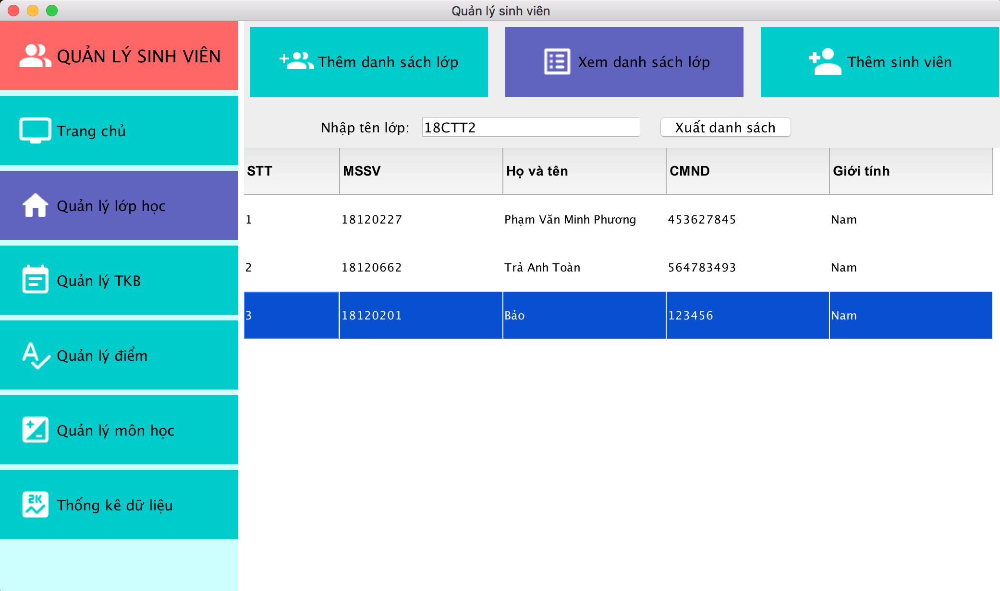  

## Yêu cầu 6: Xem TKB  

### Xem TKB theo lớp  

* Nhập `18CTT2` vào JTextField và chọn `Xem TKB`  
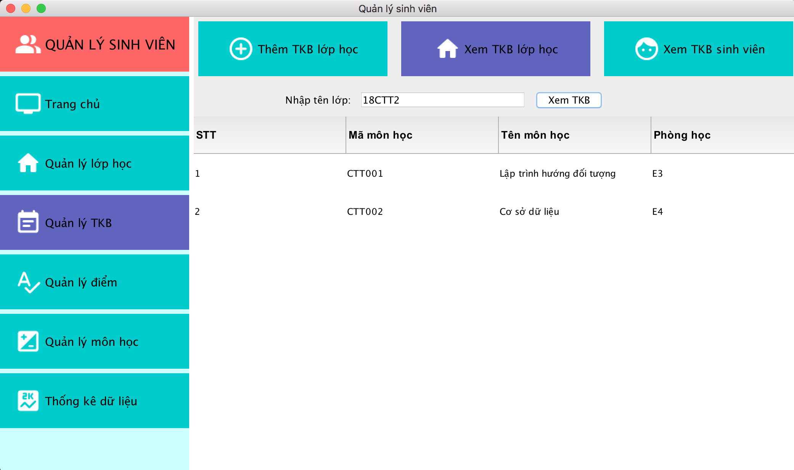  

### Xem TKB của sinh viên  

* Nhập `MSSV: 18120201` để xem TKB của `Bảo`  
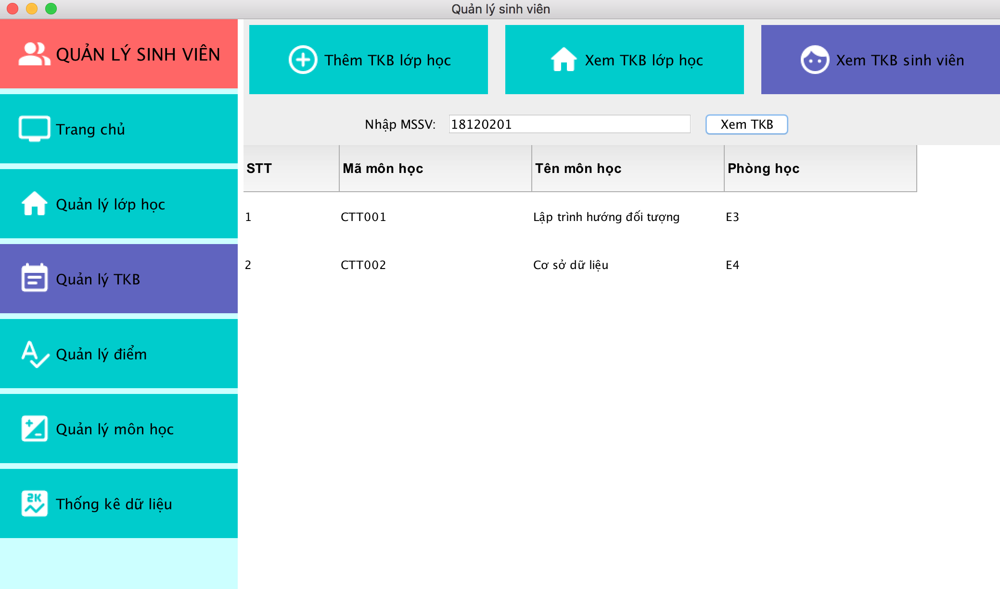  

## Yêu cầu 7: Import bảng điểm theo môn học và lớp học  

* Chọn file cần import  
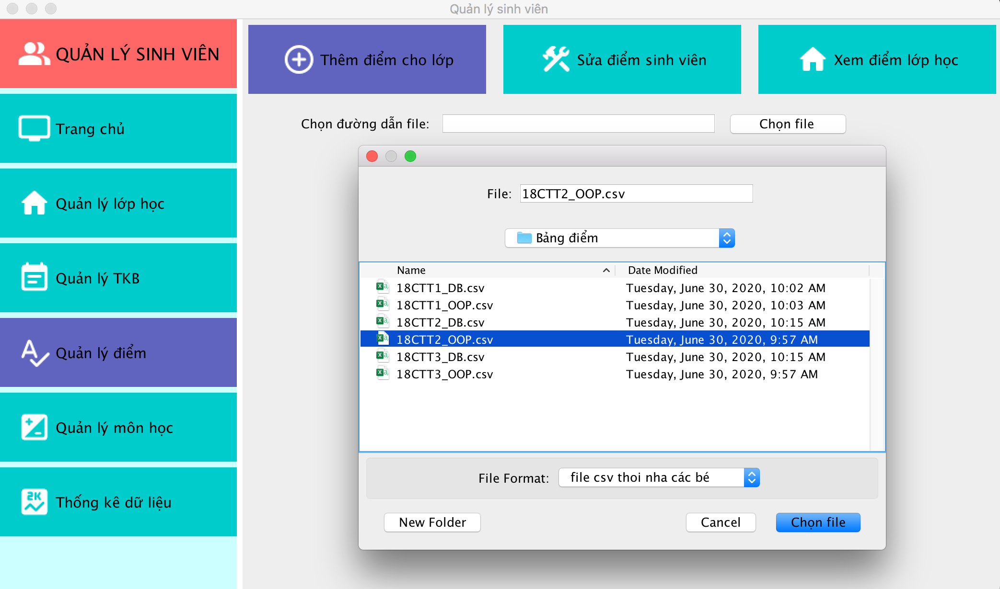  
  
* Kết quả thu được không có điểm của sinh viên `Bảo` đơn giản vì trong file không tồn tại `Bảo`  
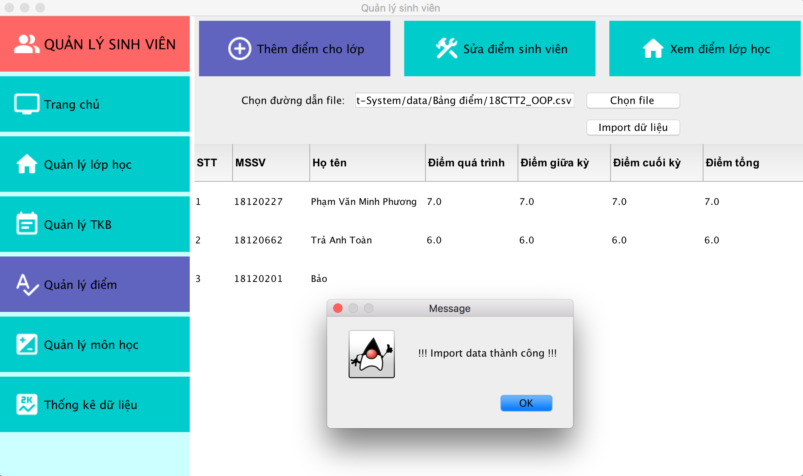  

## Yêu cầu 8: Xem bảng điểm  

* Nhập thông tin lớp và môn học  
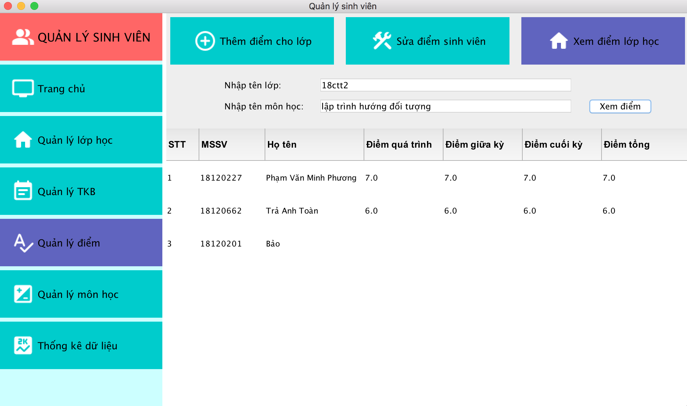  

## Yêu cầu 9: Sửa điểm sinh viên  

* Nhập điểm môn `OOP` cho `Bảo`  
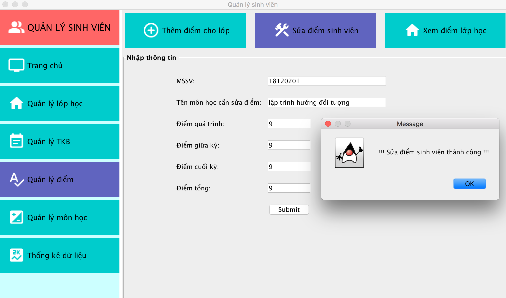  
  
* Xem lại bảng điểm `OOP` lớp `18CTT2`  
  